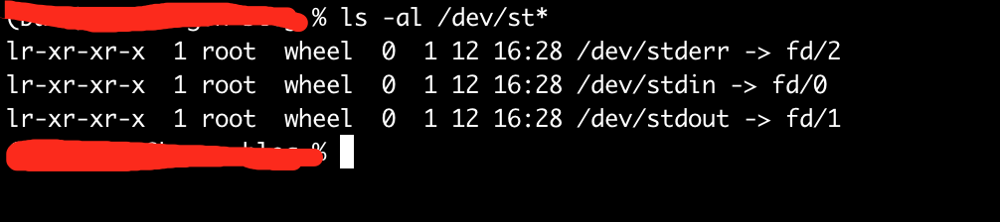

# I/O五种模型

## 前言

&emsp;&emsp;在Unix世界中万物皆文件，不论是进程、线程还是各种硬件设备，操作系统都会把它们看作是一个个的磁盘上的文件。文件的本质就是一串二进制流，信息交互和数据数据传输的过程就是对各个文件流的读写操作；根据操作或者流的方向不同，流又被分为输出流和输入流，简称I/O流（Input/Output Stream），对流的操作称为I/O操作。<br/>
&emsp;&emsp;I/O操作根据设备类型一般分为内存I/O、网络I/O和磁盘I/O，内存I/O一般不会成为性能瓶颈，磁盘I/O可以通过增加带宽和高速网卡来改善，磁盘I/O可以使用RAID磁盘阵列来提升。但是I/O操作是系统内核调用来实现，而系统调用又是通过CPU来调度。由于CPU的速度远快于I/O操作，在等待慢速I/O操作时可能会造成CPU时间片段的浪费。为了充分发挥CPU性能，逐渐发展出五种I/O模型。

## 基本概念

* 文件描述符
* 用户空间和内核空间
  
### 文件描述符

&emsp;&emsp;内核利用文件描述符（亦称文件句柄，file descriptor简称fd）来访问文件。fd是**非负整数**，可以理解为一个索引值（类比文件软连理解），打开或者创建文件，内核会返回一个文件描述符；读写文件需要使用fd来定位文件。<br/>&emsp;&emsp;每一个fd会与一个打开的文件相对应，多个fd可以指向同一个文件；换句话说，一个文件可以被不同的进程打开，也可以在同一个进程被打开多次。系统为**每个进程维护一个文件描述符表（file descriptor table）**，该表的值从0开始，所以多个进程间会有相同的fd；习惯上0被标准输入（standard input即stdin）占用，1被标准输出（standard output即stdout）占用，2被标准错误（standard error即stderr）占用。如下图: 

### 用户空间和内核空间

&emsp;&emsp;操作系统会为每个进程分配一个独立的、连续的且虚拟的地址内存空间作为进程的工作运行空间，称为虚拟内存或虚拟存储器。虚拟内存中又分为内核空间和用户空间，操作系统和驱动程序运行在内核空间，用户应用程序运行在用户空间。<br/>
&emsp;&emsp;因为内核空间和用户空间，每次I/O操作都会划分为两个阶段；内核空间和用户空间的数据传输需要通过系统调用，用户进程发起系统调用后，进程由用户态进入内核态。

## 阻塞I/O（blocking I/O）

<br/>
阻塞I/O模型中被阻塞的是用户进程，使用阻塞I/O模型读取一次数据的过程如下：

* 用户进程向内核发起系统调用recvfrom读取数据，然后等待数据进入用户空间，等待时进程被阻塞挂起，直至系统调用有结果返回（数据或者超时异常）；
* 内核开始IO的第一阶段，准备数据；通过DMA（Direct Memory Access，直接存储器访问）将数据从设备复制到内核空间，对于网络I/O来讲设备是网卡，磁盘I/O的设备磁盘；
* 数据到达内核空间后，开始IO第二阶段，将数据从内核空间复制到用户空间；
* 数据到达用户空间，内核唤醒用户进程，并通知进程数据读取完成，开始处理数据；

>&emsp;&emsp;很多文章都非常的形象拿钓鱼来举例说明，我们也拿钓鱼解释一下，并对类比的概念做一下强调。小明对应的是用户进程，鱼竿对应的是文件描述符（fd）,我们把鱼咬钩到收杆这个阶段比作内核空间，鱼篓比作用户空间（这个比喻不是很恰当，因为数据从内核空间复制到用户空间是不需要进程参与的，这里收杆进鱼篓是需要小明劳动一下，大家注意区分来看），下杆是一次系统调用，收杆是内核空间到用户空间的数据拷贝。只有把鱼收进鱼篓后，小明才能对鱼做一些不好的事情。

```
类比场景一：小明拿着一根鱼竿去湖边钓鱼，下杆后啥也不干一直盯着等待鱼咬钩，咬钩后收杆把鱼钓上来收进鱼篓，完成一次钓鱼。
```

## 非阻塞I/O（noblocking I/O）

非阻塞I/O与阻塞I/O的差异在于发起IO的系统调用时，立即返回调用结果还是被阻塞等待；非阻塞I/O只在网络I/O场景下生效，磁盘I/O无效。<br/>


* 用户进程向内核发起系统调用recvfrom读取数据，如果内核空间数据没有准备好，系统调用立刻返回，并告知没有可用数据，进程不会阻塞等待，而是一直轮询重复发起系统调用；
* 进程轮询期间也可以顺便做一些其他的事情，一般都是自旋的状态；如果数据准备导致自旋时间过长，是非常消耗CPU资源的；
* 当轮询到内核已经准备完成时，进程停止轮询，同时本次的系统调用recvfrom触发内核空间到数据空间的数据复制，同时进程处于阻塞等待状态；
* 数据到达用户空间，内核唤醒用户进程，并通知进程数据读取完成，开始处理数据。 

```
类比场景二：小明今天去钓鱼除了鱼竿还带着手机，下杆后，看一下鱼漂刷一会下手机；当看到鱼咬钩后，收杆进鱼篓。相较于场景一，
        小明在相同时间内可以做更多的事情。
```

## I/O多路复用（I/O multiplexing）

&emsp;&emsp;多路复用强调的是多个fd同时监听，对于阻塞和非阻塞I/O，每一次I/O操作发起的系统调用，都是针对一个fd。在网络I/O中，一个连接对应一个fd。如果想要同时处理多个连接，只能一比一的创建进程。理论上非阻塞I/O用轮询可以监听多个fd，但是每一次系统调用仍然是对单个fd。多路复用每次I/O操作，发起系统调用时会同时传递一组fd_set集合(其实是读fd_set、写fd_set和错误fd_set三个)来同时监控。<br/>


* 多路复用的I/O操作系统调用函数是select，同时进程阻塞在select；
* select调用时会传递一个fd集合，该集合由用户空间复制到内核空间；
* 内核拿到fd集合后，会线性遍历扫描fd集合并查看fd对应的设备是否可用，且数据是否到达内核空间，数据准备就绪会标识对应的fd状态；
* 当有至少一个fd所需的数据准备就绪，内核复制fd集合到用户空间，然后select通知进程返回可用fd数量；注意其中一次完整的select调用发生了两次fd集合复制；
* 进程拿到select返回的就绪的fd总数，会**遍历整个fd集合**，遍历完成后，针对就绪的fd，再次发起系统调用recvfrom，等待数据从内核复制到用户空间，完成数据读取；
* 多路复用有select、poll和epoll三种实现机制，本质都是同时监听多个fd;

```
类比场景三：小明感觉一根鱼竿钓的鱼太少了，看手机也快乐不起来，所有今天带了好几根鱼竿，没拿手机专心钓鱼；下杆后，
每次都挨个鱼竿看一下是否咬钩，全部鱼竿都看完，再去把咬钩的收杆。
```

### select

select机制中fd_set集合是一个数组，数组的长度即fd的数量受操作系统限制；32位系统默认是1024个，64位系统默认是2048；具体可以通过“cat /proc/sys/fs/file-max”查看；

* 每次调用select需要把fd_set集合从用户空间复制到内核空间，这是fd_set集合的第一次复制，fd比较多的时候也是有成本的；
* 内核拿到select传递过来的fd_set集合后，会遍历所有的fd来确认设备是否就绪，并开始准备数据；这是第一次fd_set集合的遍历，在fd比较多的时候这个开销不容忽视；
* 内核发现有fd数据准备好以后，会通过select返回所有fd_set集合，并通知进程有就绪的fd可操作；这是fd_set集合的第二次复制；
* 进程接收到select的返回值后，会线性遍历扫描内核返回的所有fd，这是第二次fd_set集合的遍历；然后进程对就绪的fd再次发起系统调用recvfrom;
* 因为进程对fd读写完毕后会变更fd的状态，所以下一次select调用需要重新复制fd_set集合到内核，重复上述的复制和遍历（N次复制和遍历）；
* select机制由fd_set集合是数组实现，同时受限于系统限制；所有select同时监听的fd数量是有界的。

### poll

* poll机制的工作流程和select基本一样，最大的不同就是fd_set集合的数据结构用链表来代替数组；所以理论上poll可监听的句柄数量没有限制；
* 由于两次复制和全部遍历的特点，fd数量越多复制和遍历的成本会更加的突出；

### epoll(event poll)

epoll机制需要epoll_create、epoll_ctl和epoll_wait3个系统调用来实现。

* epoll机制亦称事件驱动的poll，epoll可监听的fd数量同样没有限制，在系统调用epoll_create时可以指定监听fd的最大值，大于0就可以；
* 相较于select和poll机制，最大的不同就是改善了多次复制和全部遍历的弊端；
* epoll会在内核维护一个红黑树，每次系统调用都会把需要监听的fd添加到红黑树中，并为fd创建一个callback函数；
* 内核同时会维护一个等待队列（wait queue），当内核中某个fd准备就绪后，fd对应的回调函数会把fd注册到等待队列中；
* 用户进程阻塞在epoll_wait调用，epoll_wait返回的等待队列就绪的fd数量，进程可以访问等待队列中就绪的fd，避免了挨个线性遍历扫描；

>Tips: 很多文章说epoll是通过mmap开辟了共享空间优化fd_set集合的多次复制，这个是不正确的，很多同学也在纠正这个说法。翻了一下epoll.h源码没有找到mmap相关的东西。
>mmap是一个内存映射文件函数，进程可以直接以操作内存的方式进行文件数据读写,类比一下文件软连接来理解，但数据会直接写入文件。
>比如文件上传保存，通过mmap申请映射内存块，进程接受网卡文件流进内存过程实际是直接由网卡进内核，然后通过内核直接写入到磁盘。
>省去了用户空间和内核空间的数据复制开销，也就是我们常说的零拷贝。Kafka高吞吐性能基础就是日志的顺序读写和零拷贝的应用。

```c
int  epoll_create(int size);
int  epoll_ctl(int epfd, int op, int fd, struct epoll_event *event);
int  epoll_wait(int epfd, struct epoll_event *events, int maxevents, int timeout);
```

#### epoll_create(int size)

* 创建一个epoll句柄，占用一个fd;可以通过/proc/进程ID/fd查看，epoll用完后记得主动close，否则会导致fd占用浪费；
* size是指定可监听fd数量最大值;
* 该函数的返回值就是下面两个函数参数列表中的epfd;

#### epoll_ctl(int epfd, int op, int fd, struct epoll_event *event)

* epoll的事件注册函数，把要监听的事件类型提前向内核中注册；
* 函数执行成功返回0，失败返回-1；
* 第一个参数epfd是epoll句柄，epoll_create函数的返回值；
* 第二个参数op表示操作类型，用宏来表示：
  * EPOLL_CTL_ADD：注册新的fd到epfd中；
  * EPOLL_CTL_MOD：修改已经注册的fd的监听事件结构；
  * EPOLL_CTL_DEL：从epfd中删除一个fd；
* 第三个参数fd表示要监听操作的fd；
* 第四个参数event指定事件, struct epoll_event的结构如下：

```c
enum EPOLL_EVENTS
  {
    EPOLLIN = 0x001,
#define EPOLLIN EPOLLIN
    EPOLLPRI = 0x002,
#define EPOLLPRI EPOLLPRI
    EPOLLOUT = 0x004,
#define EPOLLOUT EPOLLOUT
    EPOLLRDNORM = 0x040,
#define EPOLLRDNORM EPOLLRDNORM
    EPOLLRDBAND = 0x080,
#define EPOLLRDBAND EPOLLRDBAND
    EPOLLWRNORM = 0x100,
#define EPOLLWRNORM EPOLLWRNORM
    EPOLLWRBAND = 0x200,
#define EPOLLWRBAND EPOLLWRBAND
    EPOLLMSG = 0x400,
#define EPOLLMSG EPOLLMSG
    EPOLLERR = 0x008,
#define EPOLLERR EPOLLERR
    EPOLLHUP = 0x010,
#define EPOLLHUP EPOLLHUP
    EPOLLRDHUP = 0x2000,
#define EPOLLRDHUP EPOLLRDHUP
    EPOLLEXCLUSIVE = 1u << 28,
#define EPOLLEXCLUSIVE EPOLLEXCLUSIVE
    EPOLLWAKEUP = 1u << 29,
#define EPOLLWAKEUP EPOLLWAKEUP
    EPOLLONESHOT = 1u << 30,
#define EPOLLONESHOT EPOLLONESHOT
    EPOLLET = 1u << 31
#define EPOLLET EPOLLET
  };
/* Valid opcodes ( "op" parameter ) to issue to epoll_ctl().  */
#define EPOLL_CTL_ADD 1        /* Add a file descriptor to the interface.  */
#define EPOLL_CTL_DEL 2        /* Remove a file descriptor from the interface.  */
#define EPOLL_CTL_MOD 3        /* Change file descriptor epoll_event structure. */
typedef union epoll_data
{
  void *ptr;
  int fd;
  uint32_t u32;
  uint64_t u64;
} epoll_data_t;
struct epoll_event
{
  uint32_t events;        /* Epoll events，对应上面的枚举EPOLL_EVENTS*/
  epoll_data_t data;        /* User data variable */
} __EPOLL_PACKED;
```

#### epoll_wait(int epfd, struct epoll_event* events, int maxevents, int timeout)

* 该函数主要作用是在指定的超时时间范围内等待一组就绪的事件，函数执行成功返回就绪的fd个数，返回0说明超时，失败返回-1；
* 第一个参数epfd是epoll句柄，epoll_create函数的返回值；
* 第二个参数events表示一个数组，内核会将等待队列中就绪的fd赋值（至于是不是复制我不知道）到该数组中，处理就绪的fd只需要直接遍历该数组；
* 第三个参数maxevents告诉内核最大监听多少个准备就绪的事件，不能大于epoll_create的参数size;
* 第四个参数timeout设置等待超时时间，单位毫秒；

## 信号驱动I/O（signal blocking I/O）

信号驱动I/O仍然是监听一个fd，只不过在系统调用前建立一个信号处理函数，内核数据准备就绪后内核会通过信号处理函数通知进程，这个阶段进程不会阻塞；许多资料说该I/O模型很少使用。
<br/>

* 进程建立信号处理函数，然后发起系统调用sigacton并立即返回，向内核传递信号对象SIGIO，进程继续运行不会阻塞；
* 当内核数据准备就绪，内核向信号处理函数发送SIGIO对象通知进程；
* 进程收到通知后，发起系统调用recvfrom，等待数据复制进内核空间，完成数据读取；
* 相较于非阻塞I/O，信号驱动I/O不需要轮询访问内核，降低CPU空转；
* 其实信号驱动既有多路复用epoll机制的影子，也有异步I/O的雏形；

```
类比场景四：小明不想老是盯着鱼竿，所以今天给鱼竿安装了一个铃铛，下干后就一直刷手机，等待铃铛响了后再去收杆。
技能完全放松的刷手机，又不会漏掉上钩的每条鱼；同时避免了检查鱼竿的时间浪费。
```

## 异步I/O（asynchronous I/O）

异步I/O全称异步非阻塞I/O，对比阻塞I/O(同步阻塞I/O)来看，流程图例非常相似，但异步I/O模型中整个I/O过程进程不会被阻塞挂起；
<br/>

* 进程发起系统调用aio_read，内核立即返回，不会阻塞进程；
* 内核进入数据准备阶段，准备就绪复制数据到用户空间；
* 当第一阶段和第二阶段全部完成，内核会发送一个信号或者基于回调函数通知进程，完成本次I/O操作；
* 阻塞I/O确恰恰相反，在第一和第二阶段全程被阻塞挂起；

## 再话同步和异步

&emsp;&emsp;概念上说的通俗一点，同步和异步的本质区别是，函数方法被调用时，是否会立刻返回调用结果；如果函数调用后，必须等待相应的计算任务完成才能拿到返回值，这就是同步；如果方法调用时，传参回调函数，方法立刻返回，进程可以去做其他事情，等相关计算任务完成后被调用方通过执行回调函数来返回计算结果，这就是异步。

* I/O模型中除异步I/O，其他四种均为同步操作；
* 通过对比异步I/O和其他四种I/O模型的流程图例来看，同步和异步的区别在于用户进程发起系统调用后，是否需要等待直至数据进入用户空间；
* 同步I/O操作均使用了系统调用recvfrom，然后等待数据进入用户空间，系统调用才有返回值；
* 异步I/O的系统调用立即返回无需等待，等到数据完全进入用户空间后，继续I/O操作；
* 概括一下，异步I/O模型全流程没有使用**同步的系统调用**，其他四种I/O模型流程中，存在**同步的系统调用**;

## 再话阻塞和非阻塞

阻塞即为进程被挂起，直到被唤醒才能继续工作；

* 阻塞I/O和多路复用是阻塞，多路复用进程被阻塞在select系统调用；
* 多路复用同时监听一个fd_set集合，相对于阻塞I/O，中和了阻塞的成本开销；
* 非阻塞I/O进程不挂起，一直轮询系统调用，有时会导致CPU空转占用过多计算资源；
* 信号驱动和异步I/O不会阻塞，通过回调通知进程；

## 参考


* [1] [https://www.cnblogs.com/shengguorui/p/11949282.html](https://www.cnblogs.com/shengguorui/p/11949282.html)
* [2] [https://blog.csdn.net/buyicn/article/details/96095970](https://blog.csdn.net/buyicn/article/details/96095970)
* [3] [https://blog.csdn.net/chen19870707/article/details/42525887](https://blog.csdn.net/chen19870707/article/details/42525887)