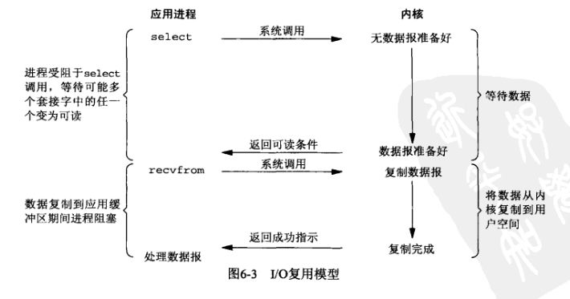
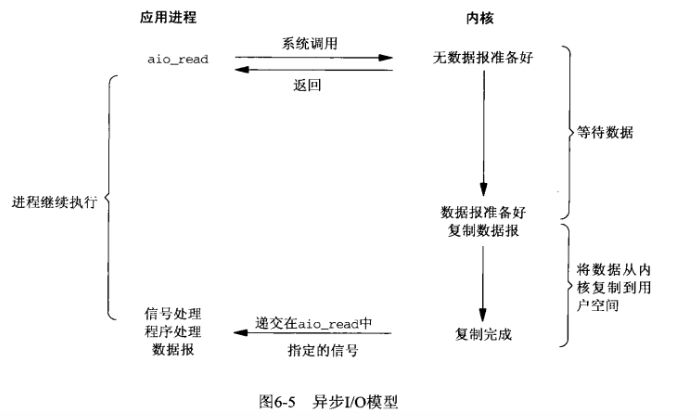

# I/O五种模型

## 前言

&emsp;&emsp;在Unix世界中万物皆文件，不论是进程、线程还是各种硬件设备，操作系统都会把它们看作是一个个的磁盘上的文件。文件的本质就是一串二进制流，信息交互和数据数据传输的过程就是对各个文件流的读写操作；根据操作或者流的方向不同，流又被分为输出流和输入流，简称I/O流（Input/Output Stream），对流的操作称为I/O操作。<br/>
&emsp;&emsp;I/O操作根据设备类型一般分为内存I/O、网络I/O和磁盘I/O，内存I/O一般不会成为性能瓶颈，磁盘I/O可以通过增加带宽和高速网卡来改善，磁盘I/O可以使用RAID磁盘阵列来提升。但是I/O操作是系统内核调用来实现，而系统调用又是通过CPU来调度。由于CPU的速度远快于I/O操作，在等待慢速I/O操作时可能会造成CPU时间片段的浪费。为了改善CPU的这种的无价值损耗，更充分的发挥CPU性能，逐渐发展出五种I/O模型。

## 基本概念

* 文件描述符
* 用户空间和内核空间
  
### 文件描述符

&emsp;&emsp;内核利用文件描述符（亦称文件句柄，file descriptor简称fd）来访问文件。fd是**非负整数**，可以理解为一个索引值（类比文件软连理解），打开或者创建文件，内核会返回一个文件描述符；读写文件需要使用fd来定位文件。<br/>&emsp;&emsp;每一个fd会与一个打开的文件相对应，多个fd可以指向同一个文件；换句话说，一个文件可以被不同的进程打开，也可以在同一个进程被打开多次。系统为**每个进程维护一个文件描述符表（file descriptor table）**，该表的值从0开始，所以多个进程间会有相同的fd；习惯上0被标准输入（standard input即stdin）占用，1被标准输出（standard output即stdout）占用，2被标准错误（standard error即stderr）占用。如下图: 

### 用户空间和内核空间

&emsp;&emsp;操作系统会为每个进程分配一个独立的、连续的且虚拟的地址内存空间作为进程的工作运行空间，称为虚拟内存或虚拟存储器。虚拟内存中又分为内核空间和用户空间，操作系统和驱动程序运行在内核空间，用户应用程序运行在用户空间。<br/>
&emsp;&emsp;因为内核空间和用户空间，每次I/O操作都会划分为两个阶段；内核空间和用户空间的数据传输需要通过系统调用，用户进程发起系统调用后，进程由用户态进入内核态。

## 阻塞I/O（blocking I/O）

<br/>
阻塞I/O模型中被阻塞的是用户进程，使用阻塞I/O模型读取一次数据的过程如下：

* 用户进程向内核发起系统调用recvfrom读取数据，然后等待数据进入用户空间，等待时进程被阻塞挂起，直至系统调用有结果返回（数据或者超时异常）；
* 内核开始IO的第一阶段，准备数据；通过DMA（Direct Memory Access，直接存储器访问）将数据从设备复制到内核空间，对于网络I/O来讲设备是网卡，磁盘I/O的设备磁盘；
* 数据到达内核空间后，开始IO第二阶段，将数据从内核空间复制到用户空间；
* 数据到达用户空间，内核唤醒用户进程，并通知进程数据读取完成，开始处理数据；

>&emsp;&emsp;很多文章都非常的形象拿钓鱼来举例说明，我们也拿钓鱼解释一下，并对类比的概念做一下强调。小明对应的是用户进程，鱼竿对应的是文件描述符（fd）,我们把鱼咬钩到收杆这个阶段比作内核空间，鱼篓比作用户空间（这个比喻不是很恰当，因为数据从内核空间复制到用户空间是不需要进程参与的，这里收杆进鱼篓是需要小明劳动一下，大家注意区分来看），下杆是一次系统调用，收杆是内核空间到用户空间的数据拷贝。只有把鱼收进鱼篓后，小明才能对鱼做一些不好的事情。

```
类比场景一：小明拿着一根鱼竿去湖边钓鱼，下杆后啥也不干一直盯着等待鱼咬钩，咬钩后收杆把鱼钓上来收进鱼篓，完成一次钓鱼。
```

## 非阻塞I/O（noblocking I/O）

非阻塞I/O与阻塞I/O的差异在于发起IO的系统调用时，立即返回调用结果还是被阻塞等待；非阻塞I/O只在网络I/O场景下生效，磁盘I/O无效。<br/>


* 用户进程向内核发起系统调用recvfrom读取数据，如果内核空间数据没有准备好，系统调用立刻返回，并告知没有可用数据，进程不会阻塞等待，而是一直轮询重复发起系统调用；
* 进程轮询期间也可以顺便做一些其他的事情，一般都是自旋的状态；如果数据准备导致自旋时间过长，是非常消耗CPU资源的；
* 当轮询到内核已经准备完成时，进程停止轮询，同时本次的系统调用recvfrom触发内核空间到数据空间的数据复制，同时进程处于阻塞等待状态；
* 数据到达用户空间，内核唤醒用户进程，并通知进程数据读取完成，开始处理数据。 

```
类比场景二：小明今天去钓鱼除了鱼竿还带着手机，下杆后，看一下鱼漂刷一会下手机；当看到鱼咬钩后，收杆进鱼篓。相较于场景一，
        小明在相同时间内可以做更多的事情。
```

## I/O多路复用（I/O multiplexing）

&emsp;&emsp;多路复用强调的是多个fd同时监听，对于阻塞和非阻塞I/O，每一次I/O操作发起的系统调用，都是针对一个fd。在网络I/O中，一个连接对应一个fd。如果想要同时处理多个连接，只能一比一的创建进程。理论上非阻塞I/O用轮询可以监听多个fd，但是每一次系统调用仍然是对单个fd。多路复用每次I/O操作，发起系统调用时会同时传递一组fd_set集合(其实是读fd_set、写fd_set和错误fd_set三个)来同时监控。<br/>



* 多路复用的I/O操作系统调用函数是select，同时进程阻塞在select；
* select调用时会传递一个fd集合，该集合由用户空间复制到内核空间；
* 内核拿到fd集合后，会遍历fd集合并查看fd对应的设备是否可用，且数据是否到达内核空间，数据准备就绪会标识对应的fd状态；
* 当有至少一个fd所需的数据准备就绪，内核复制fd集合到用户空间，然后select通知进程返回可用fd数量；注意其中一次完整的select调用发生了两次fd集合复制；
* 进程拿到select的返回值，会**遍历整个fd集合**，遍历完成后，针对就绪的fd，再次发起系统调用recvfrom，等待数据从内核复制到用户空间，完成数据读取；
* 多路复用有select、poll和epoll三种实现机制，本质都是同时监听多个fd;

### select

select机制中fd_set集合是一个数组，数组的长度即fd的数量受操作系统限制；32位系统默认是1024个，64位系统默认是2048；具体可以通过“cat /proc/sys/fs/file-max”查看；

* 每次调用select需要把fd_set集合从用户空间复制到内核空间，这是fd_set集合的第一次复制，fd比较多的时候也是有成本的；
* 内核拿到select传递过来的fd_set集合后，会遍历所有的fd来确认设备是否就绪，并开始准备数据；这是第一次fd_set集合的遍历，在fd比较多的时候这个开销不容忽视；
* 内核发现有fd数据准备好以后，会通过select返回所有fd_set集合，并通知进程有就绪的fd可操作；这是fd_set集合的第二次复制；
* 进程接收到select的返回值后，会遍历内核返回的所有fd，这是第二次fd_set集合的遍历；然后进程对就绪的fd再次发起系统调用recvfrom;
* select机制由fd_set集合是数组实现，同时受限于系统限制；所有select同时监听的fd数量是有界的。

### poll

### epoll(event poll)


## 信号驱动I/O（signal blocking I/O）

<br/>

## 异步I/O（asynchronous I/O）

<br/>

