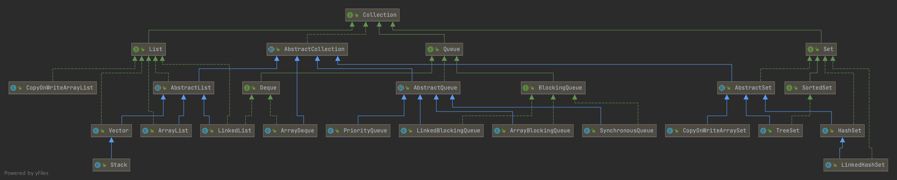
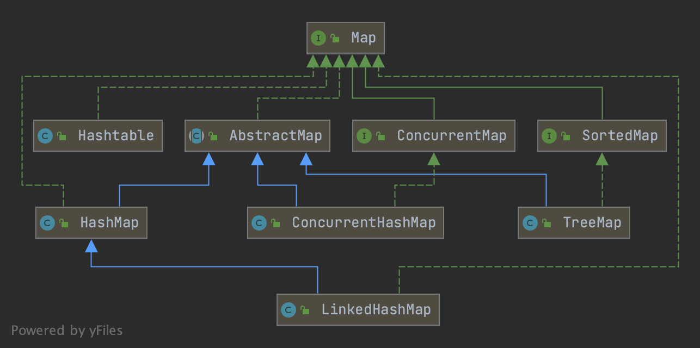

# 集合之初识

《数据结构》中的知识在JAVA中被前辈们通过Collection和Map两个接口进行了非常经典的封装。为了让程序在并发场景下更加鲁棒和高效，我们需要去掌握其实现原理。
数据结构的本质是数组和链表；堆、栈、队列、树、图以及哈希表都是在此基础上构建的。

## Collection接口 :id=collection

Collection接口是对存储一组Object对象集合的最顶层抽象；基于存储元素的存储顺序、访问顺序以及唯一性，Collection接口又细分了List、Queue和Set三个子接口。

***类图结构***

### List

List中元素存储有序，允许重复；常用的实现类有ArrayList、LinkedList、CopyOnWriteArrayList、Vector和Stack。

* **ArrayList**：基于数组存储，有界；初始大小为10，每次扩容为原来的1.5倍；线程不安全；随机访问效率高插入删除慢，适合顺序写随机读场景；
* **LinkedList**：基于双向链表存储，同时实现Deque接口，支持双端队列操作；随机访问慢插入删除快；无界，非线程安全；可以用来实现队列和栈操作；
* **Vector**：基于数组实现，有界；初始大小为10，不指定扩容增量的情况下，默认扩容为原来的2倍；synchronized关键字保障线程安全；
* **Stack**：继承Vector实现栈操作；synchronized关键字线程安全；推荐用ArrayDequeue代替；
* **CopyOnWriteArrayList**：基于数组存储，有界；读写分离；写操作在Copy的副本上操作然后赋值；利用ReentrantLock实现线程安全。

> 非线程安全的List实现类可以使用Collections.synchronizedList(List<?> list)实现线程安全，本质是sychronsized关键字。

### Set

Set最主要的特性的是元素不允许重复，底层实现依赖Map集合（CopyOnWriteArraySet例外）。常用实现类包括HashSet、SortSet和CopyOnWriteArraySet。

* **HashSet**：元素存储无序，不允许重复；依赖HashMap实现，元素作为Key存储；利用Map的put方法返回值来判断数据是否重复；所以Value不能为Null，用空的Object实例代替；
* **TreeSet**：元素存储有序，可以通过Comparator拓展排序规则；依赖TreeMap实现，存储和去重校验同上HashSet；TreeSet支持自然排序和定制排序；
* **CopyOnWriteArraySet**：存储和去重依赖CopyOnWriteArrayList实现，利用ReentrantLock实现线程安全；
* **LinkedHashSet**：元素存储有序，继承HashSet，存储基于LinkedHashMap（参考父类的构造方法）；基于链表维持插入顺序；

> CopyOnWriteArraySet是线程安全的不依赖Map，Set接口的其他实现类均非线程安全且依赖Map实现；
> 可以使用Collections.synchronizedSet(Set<?> s)实现线程安全，本质是sychronsized关键字。

### Queue

Queue是一种特殊的线性表结构，相较于List和Set的存储，更侧重数据的访问顺序；元素通常以先进先出（FIFO，即First-In-First-Out）的方式排序，优先队列和栈例外，前者通过比较器配合堆实现存储排序，栈以后进先出(LIFO，即Last-In-First-Out)的方式排序。
Queue接口下又细分为Deque(双端队列)和BlockingQueue(阻塞队列)两个接口，以及AbstractQueue抽象类对常规队列操作的基础实现。

* **AbstractQueue**
  * PriorityQueue：优先队列，无界，非线程安全；默认小顶堆排序实现（可以通过Comparator实现大顶堆）。元素不允许为null，
  不论是Comparator接口的compare(T o1, T o2)方法，还是Comparable接口的compareTo(T o)方法，参数不允许为null。
    > PriorityQueue内部存储无序，每次插入和取出只保证堆顶最小（或最大）；元素依次取出后才形成有序。

* **BlockingQueue**
  基于ReentrantLock实现阻塞，不支持动态扩容；如果队列为空读取线程被阻塞，反之队列满了写入线程被阻塞。
  * LinkedBlockingQueue：单链表实现，可以指定队列容量边界，默认为Integer.MAX_VALUE；
  * ArrayBlockingQueue：数组实现，初始化必须指定队列容量；
  * SynchronousQueue：内部没有容器存储数据，经典的生产者-消费者模式；源码中充斥着大量的CAS语句，后面单起一章分析源码。

* **Deque**
  * LinkedList：基于双向链表实现，无界，同时实现Deque接口；可以用LinkedList实现栈操作；
  * ArrayDeque：基于循环数组实现，无界，支持自动双倍扩容。因为经典的循环数组实现，后续单起一章分析源码。

## Map接口 :id=map

Map接口是对Key-Value结构的最顶层抽象，Key不允许重复，基于Key的哈希值进行散列存储。

***类图结构***

* **HashTable**
* **HashMap**
* **LinkedHashMap**
* **TreeMap**
* **CurrentHashMap**
