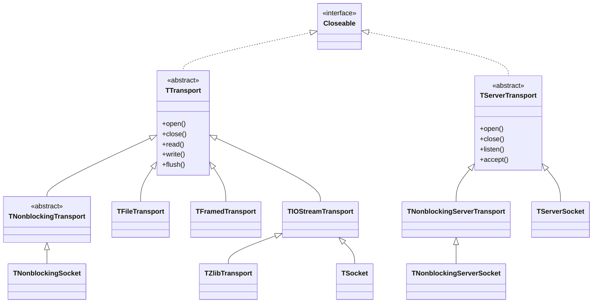
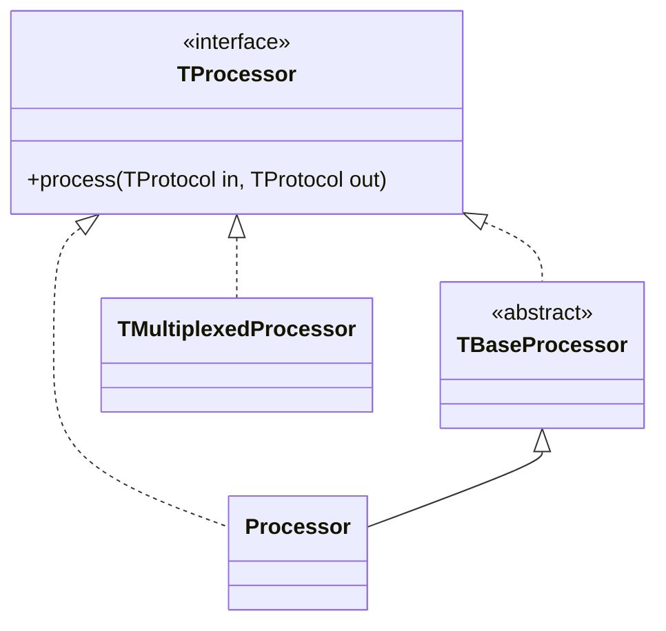
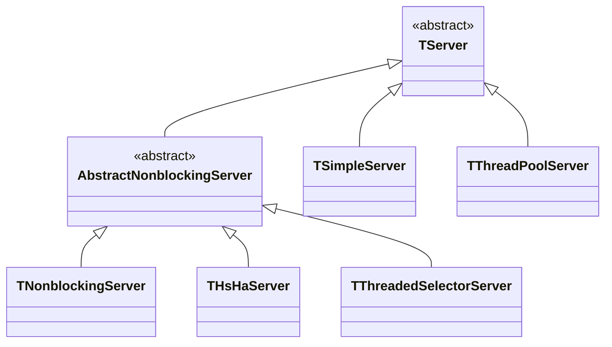

# Thrift之概念模型

## 概述

thrift网络结构栈分为4层，简单[示意图](https://thrift.apache.org/docs/concepts.html)如下：

```thrift
  +-------------------------------------------+
  | Server                                    |
  | (single-threaded, event-driven etc)       |
  +-------------------------------------------+
  | Processor                                 |
  | (compiler generated)                      |
  +-------------------------------------------+
  | Protocol                                  |
  | (JSON, compact etc)                       |
  +-------------------------------------------+
  | Transport                                 |
  | (raw TCP, HTTP etc)                       |
  +-------------------------------------------+
```

## 传输层（Transport）

传输层是对网络传输过程中读写的简单抽象，使得Thrift的底层传输和其他功能逻辑解耦分离（如序列化和反序列化）；同时网络连接也是在传输层建立。传输层分为TTransport（客户端）和
TServerTransport(服务端)两类，配合装饰器模式，通过节点流和包装流的概念来区分各种Transport实现。




>Tips: 类图绘制工具[mermaid](https://mermaid-js.github.io/mermaid/#/classDiagram)。

* 客户端传输层（TTransport）
  * TIOStreamTransport: 是最常用基于阻塞式I/O模型的传输层实现，通过一个输入流和一个输出流实现了所有的传输操作；完美的兼容Java的各种I/O流操作；是TSocket和TZlibTransport基类；
  * TSocket: 通过Socket实现TTransport，阻塞式，侧重建立连接；
  * TZlibTransport: 基于InflaterInputStream和DeflaterOutputStream(java.util.zip)实现对输入输出流的压缩，通过调用下一层的TTransport实现读写操作，是一个装饰器模式；
  * TNonblockingSocket: 通过NIO包中的SocketChannel实现非阻塞传输，服务于异步客户端实现；
  * TFramedTransport: 利用NIO包的TByteBuffer读写缓存，以栈帧为传输单位的TTransport装饰器实现；帧头部用4个填充字节来存储数据流长度，保障数据的完整性；
  * TFileTransport: 用于将数据写入文件，JAVA仅支持read操作，不支持write；
* 服务端传输层（TServerTransport）
  * TServerSocket: 服务端端阻塞式传输层，基于ServerSocket实现；
  * TNonblockingServerSocket：服务端非阻塞式传输层，基于NIO的ServerSocketChannel实现；

## 协议层（Protocol）

Protocol抽象定义了一种将内存数据结构映射为有线格式的机制，是Transport的上一层包装；简单来说是面向网络传输数据流序列化/反序列化的具体实现；

* TBinaryProtocol: 二进制编码格式的数据传输协议；
* TCompactProtocol: 高效率密集的压缩二进制的数据传输协议；
* TJSONProtocol: 使用JSON编码格式传输协议，抓包格式可见；
* TSimpleJSONProtocol: 简单的JSON格式数据传输协议；仅支持写入，用于脚本语言输出，注意不要与功能齐全的TJSONProtocol混淆；

```java
//TSimpleJSONProtocol
public static void main(String[] args) {
    try{
        Player playerDemo = new Player().setName("苍天哥").setGender(GenderEnum.FEMALE).setRole(RoleEnum.MAGE);
        FileOutputStream fos = new FileOutputStream("person.txt");
        TIOStreamTransport transport = new TIOStreamTransport(fos);
        SimpleJSONProtocol simpleJSONProtocol = new TSimpleJSONProtocol(transport);
        simpleJSONProtocol.writeMessageBegin(new TMessage("player",TMessageType.CALL, 0)); 
        playerDemo.write(simpleJSONProtocol);
        simpleJSONProtocol.writeMessageEnd();
        simpleJSONProtocol.getTransport().flush();
        fos.close();
    } catch (Exception e){
        e.printStackTrace();
    }
//文件内容
["player",1,0,{"id":0,"name":"苍天哥","role":2,"gender":2}]
```


## 处理器层（Processor）

Thrift通过使用IDL描述文件来自动生成Processor，是从输入流读取数据和写入数据到输出流的一种能力抽象，输出输出流由TProtocol实例表示；接口抽象非常的简单。



```java
//只有在定义Server端的时候用到，客户端不需要关心；示例代码：
//PlayerServiceImpl是PlayerService.Iface的实现；
private PlayerServiceImpl playerService = new PlayerServiceImpl();
//Server定义
PlayerService.Processor<PlayerService.Iface> processor = new PlayerService.Processor<>(playerService);
TServerTransport transport = new TServerSocket(3041);
TServer server = new TSimpleServer(new TServer.Args(transport).processor(processor));
System.out.println("Starting the simple server...");
server.serve();
```

### TMultiplexedProcessor

上述示例中一个Server只绑定一个Service，实际项目中往往有大量的接口服务，如果把所有接口方法写在一个Service接口文件中，不论是代码的结构优化、可读性还是后续维护都带来很多隐患和不便。
幸好，Thrift提供了TMultiplexedProcessor和TMultiplexedProtocol类来帮助开发者拆分和组装业务接口服务。

**API依赖包添加服务名枚举类规范调用：**

```java
//在定义API包的时候最好定义一个服务枚举类ServiceEnum，来约束一下服务名称；
public enum ServiceEnum {
    PLAYER("PlayerService"),
    GUILD("GuildService");

    private String serviceName;
    
    ServiceEnum(String service) {
        this.serviceName = service;
    }

    public String getServiceName() {
        return serviceName;
    }

    public ServiceEnum setServiceName(String serviceName) {
        this.serviceName = serviceName;
        return this;
    }
}
```

**服务端使用TMultiplexedProcessor类注册多个接口的服务实现类：**

```java
TMultiplexedProcessor multiplexedProcessor = new TMultiplexedProcessor();
multiplexedProcessor.registerProcessor(ServiceEnum.PLAYER.serviceName,
 new PlayerService.Processor<PlayerService.Iface>(new PlayerServiceImpl()));
multiplexedProcessor.registerProcessor(ServiceEnum.GUILD.serviceName,
 new GuildService.Processor<GuildService.Iface>(new GuildServiceImpl()));
```

**客户端使用TMultiplexedProtocol类来创建Client实例，帮助区分调用具体的服务接口：**

```java
TProtocol protocol = new TBinaryProtocol(transport);
PlayerService.Client playerService = new PlayerService.Client(
    new TMultiplexedProtocol(protocol, ServiceEnum.PLAYER.serviceName));
GuildService.Client playerService = new GuildService.Client(
    new TMultiplexedProtocol(protocol, ServiceEnum.GUILD.serviceName));
```

## 服务器层（Server）

Server的职责是将上述的TTransport、TProtocol和TProcessor等Thrift各种特性组合起来创建一个服务端示例，对外提供接口服务。基本工作流程如下：

1. 创建一个transport实例，建立连接通道；
2. 为transport创建输入输出流传输协议protocols;
3. 基于传输协议创建一个处理器processor；
4. 等待接入连接并将其转交给processor；



* TSimpleServer:
* TThreadPoolServer:
* THsHaServer:
* TThreadedSelectorServer:

## 参考

* [1] [官方概念介绍（https://thrift.apache.org/docs/concepts.html）](https://thrift.apache.org/docs/concepts.html)
* [2] [官方JAVA教程（https://thrift.apache.org/tutorial/java.html）](https://thrift.apache.org/tutorial/java.html)
* [3] [https://www.cnblogs.com/mikisakura/p/12983564.html](https://www.cnblogs.com/mikisakura/p/12983564.html)